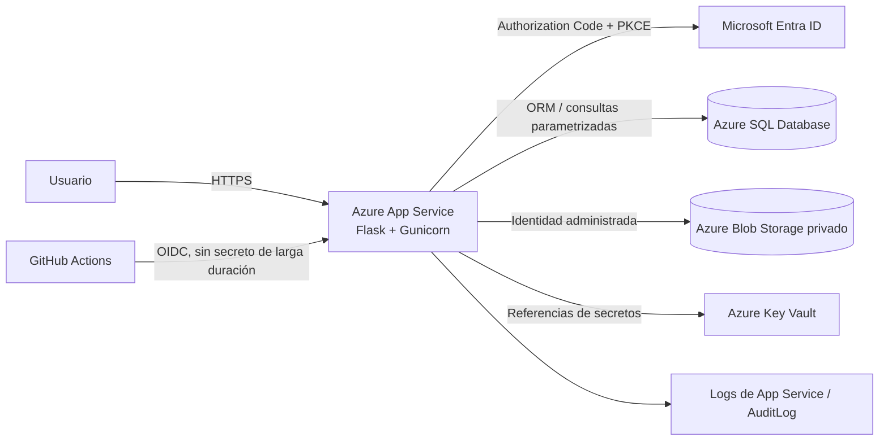

# Arquitectura de SecureAuth Store

## Límites de confianza

1. El navegador solo recibe una cookie de sesión firmada, `HttpOnly`, `Secure` en producción y `SameSite=Lax`.
2. Microsoft Entra ID valida la identidad y emite el rol `Admin` o `Customer` en el token.
3. El backend aplica autorización nuevamente en cada ruta sensible; ocultar un botón en HTML no constituye autorización.
4. Azure SQL nunca recibe SQL construido mediante concatenación. SQLAlchemy enlaza valores como parámetros y los criterios dinámicos de ordenamiento salen de una lista permitida.
5. Blob Storage permanece privado. Las imágenes se sirven por el backend después de validar y normalizar el archivo.
6. App Service usa identidad administrada para Azure SQL, Blob y Key Vault. GitHub Actions usa OIDC.

## Flujo de autenticación

1. `/auth/login` crea un Authorization Code Flow de MSAL.
2. MSAL incorpora `state`, `nonce` y PKCE.
3. Entra ID devuelve el código a `/auth/callback`.
4. MSAL valida la respuesta y el backend rota la sesión para evitar fijación.
5. Solo se guardan en sesión `oid`, nombre, correo y roles; no se guarda el access token.

## Controles de seguridad

- SQLi: ORM, parámetros enlazados, listas permitidas para `ORDER BY`, usuario SQL con mínimo privilegio.
- XSS: autoescape de Jinja, normalización de imágenes y CSP restrictiva sin JavaScript inline.
- CSRF: `Flask-WTF/CSRFProtect` en todos los POST.
- Carga de archivos: máximo 2 MB, detección real con Pillow, formatos JPEG/PNG/WEBP, rechazo de SVG, límite de píxeles y nuevo nombre UUID.
- Sesión: cookie `HttpOnly`, `Secure`, `SameSite=Lax`, expiración de 30 minutos y rotación tras autenticación.
- Fuerza bruta/abuso: Flask-Limiter; Redis en despliegues con múltiples instancias.
- Auditoría: inicio/cierre de sesión, acciones de carrito, checkout y administración, con IP seudonimizada mediante HMAC.
- Transporte: redirección HTTPS, HSTS, CSP, anti-clickjacking y política de permisos.
