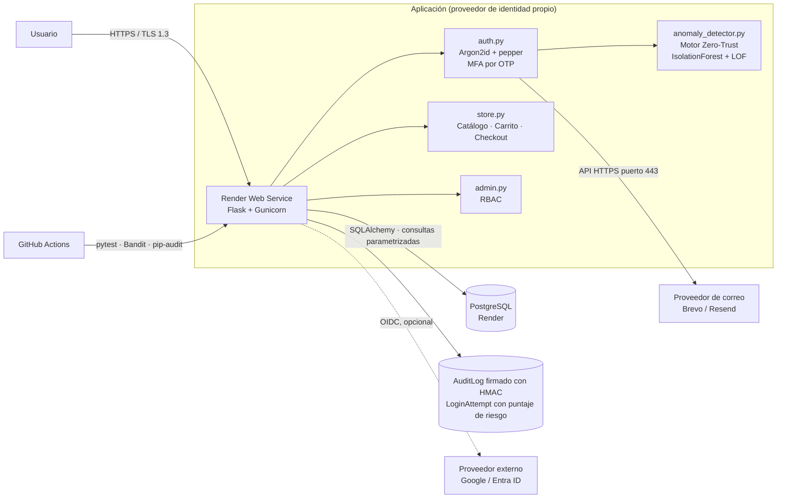
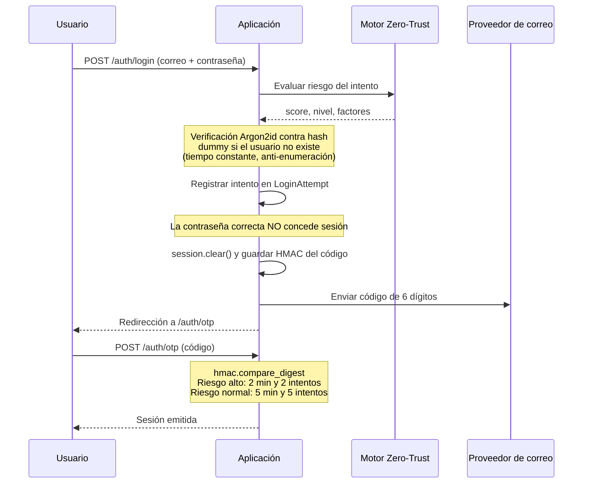
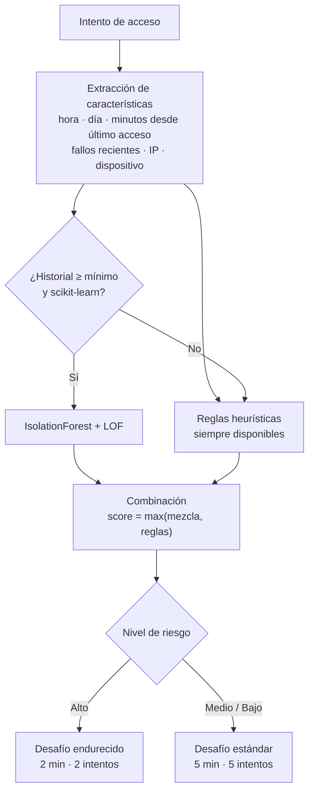
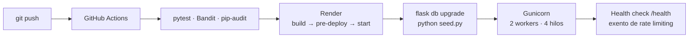

# Arquitectura de SecureAuth Store

## Vista general

> Las líneas punteadas indican un componente implementado pero
> sin credenciales configuradas: ver
> [Estado del inicio de sesión federado](#estado-del-inicio-de-sesión-federado).

## Estado del inicio de sesión federado

El flujo **OAuth 2.0 / OpenID Connect con Authorization Code**
está implementado con Authlib en `app/auth.py`
(`google_login` y `google_callback`): descubrimiento por
`server_metadata_url`, scope `openid email profile`, validación
de la respuesta y rotación de sesión tras autenticar.

Está **inactivo por falta de credenciales**. Sin
`GOOGLE_CLIENT_ID` y `GOOGLE_CLIENT_SECRET` reales, la
aplicación desactiva el proveedor, oculta el botón y protege
ambas rutas (`GOOGLE_OAUTH_ENABLED` en `app/__init__.py`).

Entra ID es OIDC estándar, igual que Google: cambiar de
proveedor supone sustituir la URL de metadatos por la del
tenant y las tres variables de entorno. Las claves `ENTRA_*`
siguen declaradas en `app/config.py` para ese fin.

**Decisión de diseño y su costo.** La aplicación funciona como
proveedor de identidad propio en vez de delegar en uno
federado. Esto amplía la superficie de ataque —pasamos a
custodiar credenciales— y por eso el nivel de almacenamiento
recibió el mayor esfuerzo del proyecto:

| Función que aportaría el proveedor federado | Implementación propia |
|---|---|
| No custodiar contraseñas | Argon2id + salt único + pepper fuera de la BD |
| MFA delegado | OTP al correo, HMAC en sesión, comparación en tiempo constante |
| Identity Protection (Entra ID P2) | `anomaly_detector.py`: IsolationForest + LOF |
| Conditional Access (Entra ID P2) | Riesgo alto reduce el desafío a 2 minutos y 2 intentos |
| Registro de inicios de sesión | `AuditLog` firmado con HMAC + `LoginAttempt` con puntaje |
| Roles en el token | RBAC verificado en servidor en las 7 rutas administrativas |

## Límites de confianza

1. **Navegador → aplicación.** El navegador solo recibe una
   cookie de sesión firmada, `HttpOnly`, `Secure` en producción,
   `SameSite=Lax` y con prefijo `__Host-`. Nada del estado de
   autorización viaja en el cliente.
2. **Formulario → servidor.** Ningún dato enviado por el
   navegador se considera confiable: el total del pedido se
   recalcula desde la base, el método y el proveedor de pago se
   validan contra listas permitidas, y ocultar un campo en la
   interfaz no sustituye la validación del servidor.
3. **Sesión → autorización.** El rol se lee de la sesión del
   servidor, nunca de un parámetro. Cada ruta sensible vuelve a
   comprobar permisos; ocultar un botón no es autorización.
4. **Aplicación → base de datos.** SQLAlchemy enlaza todos los
   valores como parámetros. Los criterios dinámicos de
   ordenamiento salen de una lista permitida.
5. **Aplicación → correo.** El segundo factor viaja cifrado:
   API HTTPS sobre el puerto 443, o SMTP con STARTTLS y
   verificación de certificado. El código nunca se registra en
   los logs de producción.
6. **Proxy → aplicación.** `ProxyFix` interpreta
   `X-Forwarded-For` y `X-Forwarded-Proto`, de modo que el rate
   limiting distingue usuarios reales en vez de agrupar a todos
   bajo la IP del proxy.

## Flujo de autenticación local

Puntos relevantes:

1. La contraseña se procesa con `HMAC-SHA256(pepper, contraseña)`
   antes del hash Argon2id. El pepper vive fuera de la base.
2. Los hashes anteriores al pepper siguen validando y se
   regeneran en el primer acceso correcto, sin forzar cambio de
   contraseña.
3. La sesión se rota antes de emitir el desafío, lo que cierra
   la fijación de sesión.
4. En sesión solo se guardan `oid`, nombre, correo y roles.
   Nunca el código OTP en claro ni tokens de acceso.

## Motor Zero-Trust

**El modelo solo puede elevar el riesgo, nunca reducirlo.** Los
modelos no supervisados observan hora y día de la semana; sin
ese piso, una ráfaga de fallos desde un dispositivo desconocido
quedaba diluida a riesgo medio solo porque el horario era el
habitual. Una señal dura de seguridad no puede ser enmascarada
por una estadística de comportamiento.

Las direcciones IP se almacenan **hasheadas**: el motor solo
necesita saber si la red es la misma de siempre, no cuál es.

## Controles de seguridad

| Amenaza | Control |
|---|---|
| Inyección SQL | ORM con parámetros enlazados, listas permitidas para `ORDER BY` |
| XSS | Autoescape de Jinja2, sin `\|safe` ni `Markup`, CSP con `script-src 'self'` |
| CSRF | `Flask-WTF/CSRFProtect` en todos los POST |
| Carga de archivos | Máximo 2 MB, detección real con Pillow, JPEG/PNG/WEBP, rechazo de SVG, recodificación que elimina metadatos, nombre UUID |
| Fijación de sesión | Rotación tras autenticar |
| Fuerza bruta | Flask-Limiter por ruta y global; Redis en despliegues multi-instancia |
| Enumeración de usuarios | Mensaje idéntico exista o no la cuenta, hash dummy para igualar tiempos |
| IDOR | Consultas filtradas por el usuario en sesión; recurso ajeno devuelve 404 |
| Manipulación de precios | Total recalculado en el servidor |
| Datos de tarjeta | Solo se persisten los últimos 4 dígitos; nunca PAN ni CVV |
| Clickjacking | `X-Frame-Options: DENY` |
| Transporte | HTTPS forzado, HSTS de 1 año con preload |
| Manipulación de registros | Auditoría firmada con HMAC |

## Despliegue

Notas de despliegue:

- Las migraciones se ejecutan en la fase de **pre-deploy**,
  nunca en el proceso que sirve tráfico.
- La sonda `/health` está exenta del rate limiting: apuntada a
  una ruta limitada, el verificador recibía `429` y la
  plataforma reiniciaba el servicio en bucle.
- Los archivos estáticos también están exentos: una carga del
  catálogo son 15 peticiones y agotaba la cuota de usuarios
  legítimos.
- Render bloquea los puertos SMTP salientes en el plan
  gratuito, por lo que el segundo factor se entrega mediante
  API HTTPS.

## Documentos relacionados

- [`SECURITY.md`](SECURITY.md) — los cinco niveles de seguridad en detalle
- [`OWASP.md`](OWASP.md) — mapeo del OWASP Top 10 (2021)
- [`README.md`](README.md) — despliegue local y en línea
