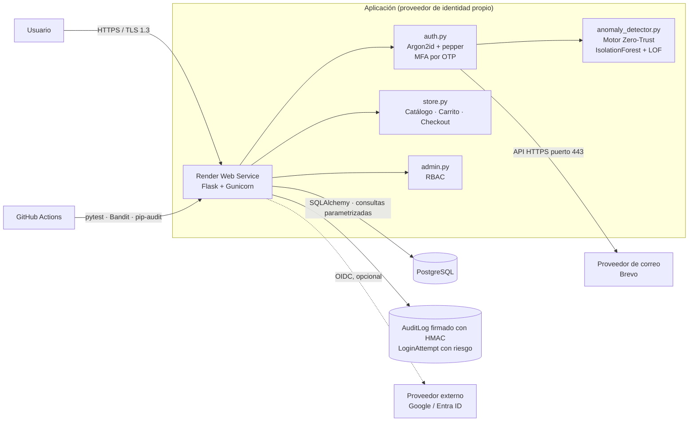
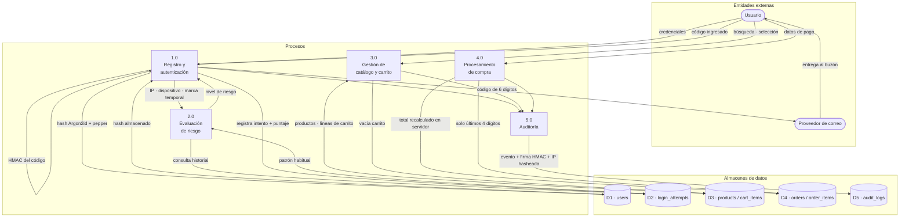
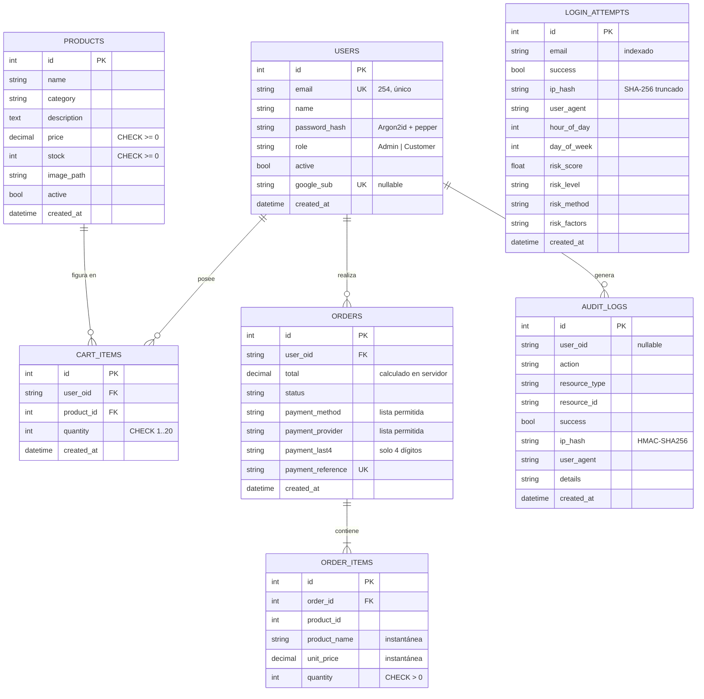
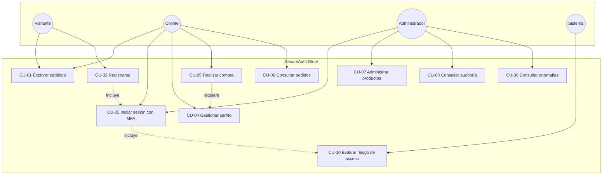
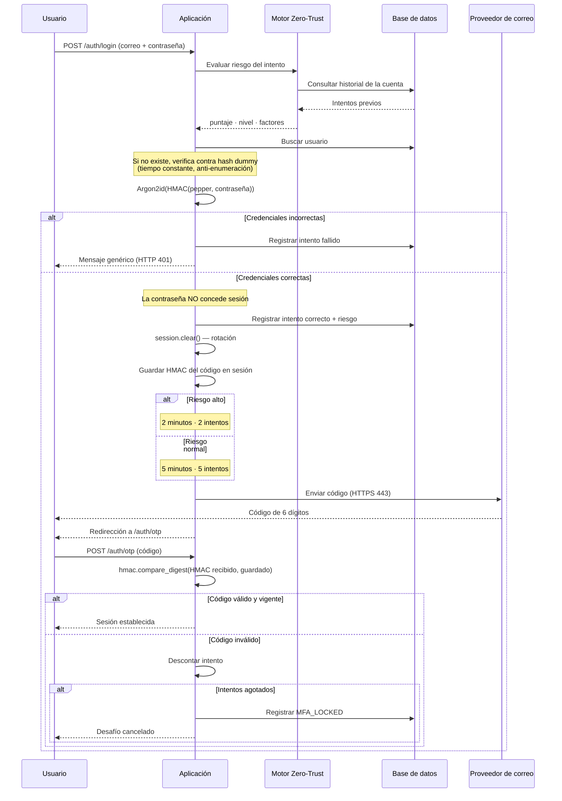
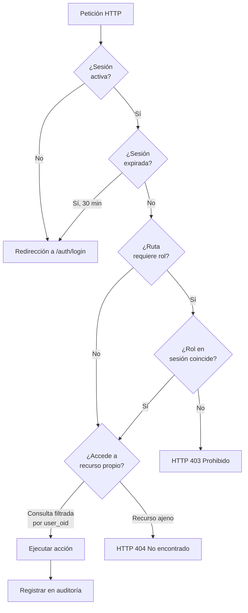
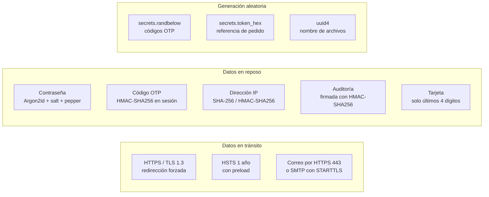

<div align="center">

# SecureAuth Store

## Plataforma de comercio electrónico con autenticación multifactor y detección de anomalías por comportamiento

<br>

**Documento técnico del proyecto**

<br>

**Curso:** DD281 — Programación Segura
**Carrera:** Ingeniería de Sistemas — Ciclo VIII
**Universidad Autónoma del Perú**
**Periodo:** 2026-1

<br>

**Autor:** Lindo Barrientos, Jhonn Viequier

<br>

**Repositorio:** https://github.com/anaastoac/PS-P1-SecureAuth-Platform
**Despliegue:** https://secureauth-store.onrender.com

<br>

Julio de 2026

</div>

<div style="page-break-after: always;"></div>

---

# Índice

1. [Descripción del proyecto](#1-descripción-del-proyecto)
2. [Objetivos](#2-objetivos)
3. [Arquitectura del sistema](#3-arquitectura-del-sistema)
4. [Diagrama de flujo de datos](#4-diagrama-de-flujo-de-datos)
5. [Modelo de base de datos](#5-modelo-de-base-de-datos)
6. [Casos de uso](#6-casos-de-uso)
7. [Flujos de seguridad](#7-flujos-de-seguridad)
   - 7.1 [Autenticación](#71-autenticación)
   - 7.2 [Autorización](#72-autorización)
   - 7.3 [Protección criptográfica](#73-protección-criptográfica)
8. [Decisiones técnicas de seguridad](#8-decisiones-técnicas-de-seguridad)
9. [Cobertura del OWASP Top 10](#9-cobertura-del-owasp-top-10)
10. [Verificación y pruebas](#10-verificación-y-pruebas)
11. [Limitaciones reconocidas](#11-limitaciones-reconocidas)
12. [Conclusiones](#12-conclusiones)
13. [Bibliografía](#13-bibliografía)

<div style="page-break-after: always;"></div>

---

# 1. Descripción del proyecto

**SecureAuth Store** es una tienda en línea que funciona como
su propio proveedor de identidad, desarrollada para demostrar
la aplicación práctica de controles de seguridad en las cinco
capas de una aplicación web: transporte, almacenamiento,
sesión, aplicación e infraestructura.

El sistema permite a un usuario registrarse, verificar su
correo, iniciar sesión con verificación en dos pasos, navegar
un catálogo de productos, gestionar un carrito y completar una
compra con generación de comprobante. Un administrador puede
además gestionar el inventario y consultar los registros de
auditoría y de riesgo.

La particularidad del proyecto no está en la funcionalidad
comercial, que es deliberadamente simple, sino en **cómo se
protege cada operación**. Tres elementos lo distinguen de una
aplicación web convencional:

**Autenticación multifactor obligatoria.** La contraseña
correcta nunca concede acceso por sí sola: inicia un desafío
mediante un código de un solo uso enviado al correo del
usuario.

**Motor Zero-Trust de detección de anomalías.** Cada intento de
acceso se evalúa contra el patrón de comportamiento habitual de
la cuenta —hora, día, red, dispositivo y fallos recientes—
mediante un enfoque híbrido que combina reglas heurísticas con
modelos de aprendizaje automático no supervisado. Un
comportamiento anómalo endurece automáticamente el segundo
factor.

**Almacenamiento de credenciales en profundidad.** Las
contraseñas se protegen con Argon2id, salt único por usuario y
un *pepper* global que reside fuera de la base de datos, de
modo que una filtración de la base no basta para atacarlas.

## 1.1 Alcance

| Incluido | No incluido |
|---|---|
| Registro verificado por correo | Pasarela de pago real |
| Autenticación local con MFA | Aplicación móvil |
| Detección de anomalías por comportamiento | Recuperación de contraseña |
| Catálogo, carrito y proceso de compra | Gestión de envíos e inventario avanzado |
| Panel administrativo con control por roles | Facturación electrónica |
| Auditoría firmada criptográficamente | |
| Despliegue en producción con HTTPS | |

## 1.2 Tecnologías

| Capa | Tecnología |
|---|---|
| Lenguaje | Python 3.12 |
| Framework web | Flask 3 (patrón *application factory*) |
| ORM | SQLAlchemy 2 |
| Migraciones | Alembic (Flask-Migrate) |
| Base de datos | PostgreSQL (producción) · SQLite (desarrollo) |
| Hash de contraseñas | argon2-cffi (Argon2id) |
| Cabeceras de seguridad | Flask-Talisman |
| Protección CSRF | Flask-WTF |
| Control de tasa | Flask-Limiter |
| Aprendizaje automático | scikit-learn (IsolationForest, LocalOutlierFactor) |
| Entrega de correo | API HTTPS (Brevo) · SMTP con STARTTLS |
| Servidor de aplicación | Gunicorn |
| Plataforma | Render |
| Integración continua | GitHub Actions (pytest, Bandit, pip-audit) |

<div style="page-break-after: always;"></div>

---

# 2. Objetivos

## 2.1 Objetivo general

Desarrollar y desplegar una aplicación web de comercio
electrónico que implemente controles de seguridad verificables
en las cinco capas de la arquitectura, demostrando que la
protección de la identidad del usuario puede construirse en
profundidad y no como una única barrera.

## 2.2 Objetivos específicos

1. **Implementar autenticación multifactor** mediante código de
   un solo uso entregado por un canal independiente, de modo
   que el compromiso de una contraseña no implique el
   compromiso de la cuenta.

2. **Proteger el almacenamiento de credenciales** con un
   algoritmo de hash resistente a ataques por hardware
   especializado, incorporando salt por usuario y un secreto
   global externo a la base de datos.

3. **Detectar accesos anómalos** mediante análisis del
   comportamiento histórico de cada cuenta, escalando la
   exigencia de verificación cuando el patrón se desvía de lo
   habitual.

4. **Prevenir las vulnerabilidades del OWASP Top 10 (2021)** en
   el proceso de compra, con especial atención a la
   manipulación de precios, el acceso a recursos ajenos y la
   inyección de código.

5. **Configurar cabeceras HTTP de seguridad** que restrinjan la
   ejecución de contenido no autorizado y fuercen el uso de
   canales cifrados.

6. **Registrar y auditar los eventos de seguridad** de forma
   que la manipulación posterior de los registros sea
   detectable.

7. **Verificar los controles mediante pruebas automatizadas**
   con cobertura superior al 60%, integradas en un flujo de
   integración continua junto a análisis estático y auditoría
   de dependencias.

8. **Desplegar el sistema en un entorno público** con HTTPS,
   certificado válido y separación de configuración entre
   desarrollo y producción.

<div style="page-break-after: always;"></div>

---

# 3. Arquitectura del sistema

## 3.1 Vista general



La línea punteada indica un componente implementado pero
inactivo: el flujo OAuth 2.0 existe y es funcional, pero la
plataforma opera de forma autónoma sin él.

## 3.2 Organización del código

```
app/
├── __init__.py           Factory, extensiones, cabeceras, /health
├── config.py             Configuración por entorno
├── extensions.py         Instancias de db, limiter, csrf, talisman
├── models.py             Entidades del dominio
├── auth.py               Autenticación, MFA, registro
├── anomaly_detector.py   Motor Zero-Trust
├── store.py              Catálogo, carrito, checkout
├── admin.py              Panel administrativo, auditoría, anomalías
├── security.py           Decoradores de autorización
├── audit.py              Registro firmado de eventos
├── mailer.py             Entrega del segundo factor
├── storage.py            Validación y normalización de imágenes
├── forms.py              Validación de entrada (WTForms)
├── templates/            Vistas Jinja2
└── static/               CSS, JavaScript, imágenes
```

## 3.3 Límites de confianza

Un límite de confianza es todo punto donde un dato cambia de
dominio de control. El diseño identifica seis:

| # | Límite | Control aplicado |
|---|---|---|
| 1 | Navegador → aplicación | Solo viaja una cookie firmada; ningún estado de autorización sale al cliente |
| 2 | Formulario → servidor | Todo dato del cliente se revalida: el total se recalcula, método y proveedor se validan contra listas permitidas |
| 3 | Sesión → autorización | El rol se lee de la sesión del servidor; cada ruta sensible reverifica permisos |
| 4 | Aplicación → base de datos | SQLAlchemy enlaza todos los valores como parámetros; criterios dinámicos desde lista permitida |
| 5 | Aplicación → correo | Canal cifrado (HTTPS o STARTTLS); el código nunca se registra en logs de producción |
| 6 | Proxy → aplicación | `ProxyFix` interpreta `X-Forwarded-For` para que el control de tasa distinga usuarios reales |

<div style="page-break-after: always;"></div>

---

# 4. Diagrama de flujo de datos

Representa el recorrido de la información sensible a través del
sistema y los puntos donde se transforma o valida.



## 4.1 Transformaciones de datos sensibles

| Dato | Al entrar | Al almacenarse |
|---|---|---|
| Contraseña | Texto plano sobre TLS | `Argon2id(HMAC-SHA256(pepper, contraseña))` |
| Código OTP | Generado en servidor | `HMAC-SHA256(SECRET_KEY, código)` en sesión |
| Dirección IP | Cabecera HTTP | `SHA-256` truncado o `HMAC-SHA256` |
| Número de tarjeta | Formulario | Solo los últimos 4 dígitos |
| CVV | Formulario | **No se almacena** |
| Total del pedido | Ignorado del cliente | Recalculado desde precios vigentes |

<div style="page-break-after: always;"></div>

---

# 5. Modelo de base de datos

## 5.1 Diagrama entidad-relación



## 5.2 Decisiones de diseño con impacto en seguridad

**`users.password_hash` no admite texto plano.** No existe
ninguna columna capaz de almacenar la contraseña recuperable.
El sistema nunca necesita conocerla, solo verificar si la que
se presenta coincide.

**`order_items` guarda instantáneas.** `product_name` y
`unit_price` se copian al momento de la compra. Si el precio
del producto cambia después, el pedido histórico conserva lo
que el cliente realmente pagó, lo que además impide alterar
retroactivamente el valor de una transacción.

**`orders.payment_last4` almacena cuatro caracteres.** El
número completo y el CVV nunca llegan a la base de datos. El
esquema hace imposible almacenarlos aunque el código lo
intentara.

**`login_attempts` está desnormalizada a propósito.** Guarda
`email` en vez de una clave foránea a `users`, porque debe
registrar también los intentos contra cuentas inexistentes —
que son precisamente los indicadores de un ataque de
enumeración.

**Las IP se almacenan hasheadas** en ambas tablas de registro.
Permiten correlacionar eventos del mismo origen sin conservar
un dato personal identificable.

<div style="page-break-after: always;"></div>

---

# 6. Casos de uso

## 6.1 Diagrama



## 6.2 Casos de uso principales

### CU-03 — Iniciar sesión con verificación en dos pasos

| Campo | Detalle |
|---|---|
| **Actor** | Cliente / Administrador |
| **Precondición** | Cuenta registrada y activa |
| **Postcondición** | Sesión establecida con rol asignado |

**Flujo principal**

1. El usuario ingresa correo y contraseña.
2. El sistema evalúa el riesgo del intento contra el historial.
3. El sistema verifica la contraseña contra el hash almacenado.
4. El sistema genera un código de 6 dígitos y lo envía al correo.
5. El sistema rota la sesión y almacena el HMAC del código.
6. El usuario ingresa el código.
7. El sistema compara en tiempo constante y concede la sesión.

**Flujos alternativos**

- **3a.** Credenciales incorrectas: mensaje genérico idéntico al
  de usuario inexistente. Se registra el intento fallido.
- **4a.** Riesgo alto: el código se emite con 2 minutos de
  vigencia y 2 intentos, en lugar de 5 y 5.
- **6a.** Código incorrecto: se descuenta un intento. Al
  agotarlos, el desafío se cancela por completo.
- **6b.** Código expirado: se invalida y se exige reiniciar.
- **1a.** Más de 5 intentos por minuto: respuesta HTTP 429.

### CU-05 — Realizar compra

| Campo | Detalle |
|---|---|
| **Actor** | Cliente |
| **Precondición** | Sesión activa y carrito con productos |
| **Postcondición** | Pedido registrado, stock descontado, carrito vacío |

**Flujo principal**

1. El cliente accede al proceso de pago.
2. El sistema **recalcula el total** desde los precios vigentes.
3. El cliente elige método de pago y completa los datos.
4. El sistema valida método y proveedor contra listas permitidas.
5. El sistema registra el pedido con los últimos 4 dígitos.
6. El sistema descuenta el stock y vacía el carrito.
7. El sistema genera el comprobante.

**Flujos alternativos**

- **2a.** El cliente envía un total manipulado: se ignora.
- **4a.** Método y proveedor incoherentes: HTTP 400, sin pedido.
- **6a.** Stock insuficiente: se ajusta la cantidad al disponible.

### CU-10 — Evaluar riesgo de acceso

| Campo | Detalle |
|---|---|
| **Actor** | Sistema (automático) |
| **Disparador** | Cada intento de autenticación |
| **Postcondición** | Intento registrado con puntaje y nivel |

**Flujo principal**

1. Se extraen las características del intento.
2. Se consulta el historial de la cuenta.
3. Se aplican las reglas heurísticas.
4. Con historial suficiente, se aplican los modelos de ML.
5. Se combina tomando el mayor entre ambos resultados.
6. Se clasifica en bajo, medio o alto.
7. Se registra el intento con puntaje y factores.

## 6.3 Historias de usuario

| # | Como… | Quiero… | Para… |
|---|---|---|---|
| HU-01 | visitante | ver el catálogo sin registrarme | evaluar la oferta antes de dar mis datos |
| HU-02 | visitante | registrarme verificando mi correo | asegurar que nadie use mi dirección |
| HU-03 | cliente | que me pidan un código además de la contraseña | que mi cuenta siga protegida si me roban la contraseña |
| HU-04 | cliente | modificar cantidades en el carrito | ajustar mi pedido antes de pagar |
| HU-05 | cliente | recibir un comprobante | tener constancia de la compra |
| HU-06 | cliente | que nadie vea mis pedidos | proteger mi privacidad |
| HU-07 | administrador | gestionar productos e imágenes | mantener el catálogo actualizado |
| HU-08 | administrador | consultar quién hizo qué y cuándo | investigar incidentes |
| HU-09 | administrador | ver los accesos de riesgo | detectar intentos de intrusión |
| HU-10 | responsable de seguridad | que las contraseñas resistan una filtración | limitar el daño de una brecha |

<div style="page-break-after: always;"></div>

---

# 7. Flujos de seguridad

## 7.1 Autenticación



**Controles aplicados en este flujo**

| Control | Propósito |
|---|---|
| Hash *dummy* si el usuario no existe | Igualar el tiempo de respuesta (anti-enumeración) |
| Mensaje idéntico en ambos casos | No revelar qué correos están registrados |
| `session.clear()` antes del desafío | Cerrar la fijación de sesión |
| HMAC del código, no el código | Que leer la cookie no revele el valor |
| `hmac.compare_digest` | No filtrar información por tiempo de respuesta |
| Límite de 5 intentos/minuto | Volver inviable la fuerza bruta |
| Escalado por riesgo | Reducir la ventana ante comportamiento anómalo |

## 7.2 Autorización



**Por qué 404 y no 403 ante un recurso ajeno.** Un 403 confirma
que el recurso existe pero no es accesible, lo que permite
enumerar identificadores válidos. El 404 no distingue entre
"no existe" y "no es tuyo".

**El rol nunca viene del cliente.** Se lee de la sesión del
servidor. Ocultar un botón en la interfaz no es autorización:
cada una de las siete rutas administrativas revalida el rol
mediante el decorador `role_required`.

## 7.3 Protección criptográfica



### Justificación de cada mecanismo

**Argon2id — contraseñas.** Es una función de derivación
deliberadamente lenta y costosa en memoria, ganadora de la
*Password Hashing Competition*. Esa lentitud es la defensa: un
atacante con la base robada debe invertir tiempo y memoria por
cada intento. Un hash rápido como SHA-256 sería inadecuado
precisamente por su eficiencia.

**Salt — contra tablas precomputadas.** Valor aleatorio único
por usuario, incluido en el hash resultante. Sin él, dos
usuarios con la misma contraseña producirían el mismo hash y
una tabla arcoíris permitiría revertir miles simultáneamente.

**Pepper — contra el robo de la base.** Secreto global que
reside en variables de entorno, fuera de la base de datos. La
contraseña se procesa con `HMAC-SHA256(pepper, contraseña)`
antes de llegar a Argon2id. La diferencia con el salt es
decisiva: el salt está en la base, el pepper no. Quien obtenga
únicamente un volcado de la base carece de una pieza necesaria.

**HMAC-SHA256 — códigos, integridad y seudonimización.** No es
un hash simple sino un hash con clave: cualquiera puede
calcular el SHA-256 de un valor, pero solo quien posee la clave
puede calcular su HMAC. Se aplica en tres contextos: guardar el
código OTP sin guardarlo, firmar los registros de auditoría
para que su alteración sea detectable, y seudonimizar
direcciones IP.

**`secrets` — aleatoriedad criptográfica.** Los códigos y
referencias se generan con la fuente del sistema operativo. El
módulo `random` es predecible: conociendo algunos valores puede
deducirse el resto de la secuencia.

> **Precisión conceptual:** ninguno de estos mecanismos
> *encripta*. Cifrar es reversible; estas son funciones
> unidireccionales. El sistema nunca necesita recuperar una
> contraseña ni un código, únicamente verificar si el valor
> presentado coincide. Que fuera reversible sería un defecto,
> no una característica.

<div style="page-break-after: always;"></div>

---

# 8. Decisiones técnicas de seguridad

## Nivel 1 — Transporte

| Decisión | Justificación |
|---|---|
| HTTPS forzado con Flask-Talisman | Impide degradar la conexión a texto plano |
| HSTS de 1 año con `preload` | El navegador rechaza HTTP incluso en la primera visita |
| Correo por API HTTPS (puerto 443) | Render bloquea los puertos SMTP salientes en su plan gratuito desde septiembre de 2025 |
| Verificación de certificado en toda conexión saliente | `ssl.create_default_context()` sin excepciones |

## Nivel 2 — Almacenamiento

| Decisión | Justificación |
|---|---|
| Argon2id en lugar de bcrypt o PBKDF2 | Resistencia a ataques con GPU y ASIC por su coste en memoria |
| Pepper aplicado antes del hash | Un volcado de la base no basta para atacar los hashes |
| Migración transparente de hashes previos | Incorporar el pepper sin forzar cambio de contraseña |
| Re-hash automático si cambian los parámetros | Los hashes se refuerzan solos al endurecer la configuración |
| Arranque bloqueado sin `PASSWORD_PEPPER` en producción | Impide desplegar sin la protección activa |

## Nivel 3 — Sesión

| Decisión | Justificación |
|---|---|
| Sesión de servidor en lugar de JWT | Un JWT no puede revocarse antes de expirar; incompatible con la evaluación continua de riesgo |
| `HttpOnly` | JavaScript no puede leer la cookie |
| `Secure` en producción | La cookie no viaja por HTTP |
| `SameSite=Lax` | Segunda barrera contra CSRF |
| Prefijo `__Host-` | Un subdominio comprometido no puede sobrescribirla |
| Rotación en cada login | Cierra la fijación de sesión |
| Expiración a 30 minutos | Limita la ventana de una sesión abandonada |

## Nivel 4 — Aplicación

| Decisión | Justificación |
|---|---|
| MFA obligatorio, no opcional | Una contraseña comprometida no basta para entrar |
| Motor Zero-Trust de anomalías | Verificación continua, no solo en el momento del login |
| El modelo de ML solo puede elevar el riesgo | Una señal dura no debe ser diluida por una estadística |
| Escalado por ráfaga de fallos | El riesgo no puede depender de la hora del reloj |
| Registro verificado por correo | Nadie se registra con una dirección ajena |
| Contraseñas de 12+ caracteres y 4 clases | Amplía el espacio de búsqueda |
| Respuestas idénticas ante usuario inexistente | Impide enumerar cuentas |
| Total recalculado en el servidor | El cliente no fija el precio |
| Cantidades acotadas al stock | Evita pedidos imposibles y valores negativos |
| Solo últimos 4 dígitos de tarjeta | Reduce el impacto de una filtración |

## Nivel 5 — Infraestructura

| Decisión | Justificación |
|---|---|
| CSP con `script-src 'self'` | Bloquea la ejecución de scripts inyectados |
| `X-Frame-Options: DENY` | Impide el clickjacking |
| `X-Content-Type-Options: nosniff` | Evita la reinterpretación del tipo de contenido |
| CSRF global, no por ruta | Una ruta nueva queda protegida sin recordar añadirlo |
| Control de tasa por ruta y global | Vuelve inviable la fuerza bruta |
| Estáticos y `/health` exentos del control de tasa | Un control mal ubicado se convierte en denegación de servicio propia |
| Imágenes recodificadas al subirse | Elimina metadatos y contenido embebido |
| Nombre de archivo por UUID | Evita *path traversal* y sobrescritura |
| Rechazo de SVG | El formato admite JavaScript embebido |
| Migraciones fuera del proceso que sirve tráfico | El servidor web no altera el esquema |

<div style="page-break-after: always;"></div>

---

# 9. Cobertura del OWASP Top 10

| Categoría | Estado | Controles principales |
|---|---|---|
| **A01** Pérdida de control de acceso | Cubierto | RBAC en servidor, consultas filtradas por sesión, 404 ante recurso ajeno, validación de redirecciones |
| **A02** Fallos criptográficos | Cubierto | Argon2id + salt + pepper, HTTPS con HSTS, IP hasheadas, sin datos de tarjeta |
| **A03** Inyección | Cubierto | ORM parametrizado, listas permitidas, autoescape de Jinja2, validación con WTForms |
| **A04** Diseño inseguro | Cubierto | MFA obligatorio, motor Zero-Trust, total recalculado, degradación segura |
| **A05** Configuración incorrecta | Cubierto | Talisman, sin depuración en producción, arranque bloqueado sin secretos |
| **A06** Componentes vulnerables | Cubierto | `pip-audit` y `bandit` en cada push y semanalmente |
| **A07** Fallos de autenticación | Cubierto | OTP con HMAC, control de tasa, anti-enumeración, política de contraseñas |
| **A08** Fallos de integridad | Cubierto | Auditoría firmada con HMAC, CSRF, imágenes recodificadas |
| **A09** Registro y monitoreo | Cubierto* | Auditoría de eventos, historial con puntaje de riesgo, paneles de consulta |
| **A10** SSRF | No aplica** | Sin peticiones a URLs del usuario; destinos resueltos desde tabla interna |

\* Sin alertado automático: el monitoreo requiere consulta del
administrador.

\** No aplica por diseño, con controles preventivos ya
implementados por si el destino se hiciera configurable.

<div style="page-break-after: always;"></div>

---

# 10. Verificación y pruebas

## 10.1 Resultados

| Métrica | Valor |
|---|---|
| Pruebas automatizadas | 55 |
| Cobertura sobre `app/` | 73% |
| Hallazgos de Bandit (SAST) | 0 |
| Vulnerabilidades en dependencias | 0 |

## 10.2 Cobertura por módulo

| Módulo | Cobertura |
|---|---|
| `models.py`, `forms.py`, `extensions.py` | 100% |
| `config.py` | 97% |
| `__init__.py`, `security.py` | 93% |
| `anomaly_detector.py` | 90% |
| `audit.py` | 81% |
| `store.py` | 71% |
| `auth.py` | 68% |

## 10.3 Pruebas de penetración realizadas

| # | Vector | Resultado |
|---|---|---|
| 1 | Inyección SQL en búsqueda | Tratado como dato, no como código |
| 2 | XSS almacenado en nombre de producto | Escapado por Jinja2 |
| 3 | POST sin token CSRF | HTTP 400 |
| 4 | Escalada vertical de privilegios | HTTP 403 |
| 5 | IDOR sobre línea de carrito | HTTP 404 |
| 6 | IDOR sobre comprobante ajeno | HTTP 404 |
| 7 | Fuerza bruta en login | HTTP 429 tras 5 intentos |
| 8 | Fuerza bruta sobre el código OTP | Desafío cancelado |
| 9 | Manipulación del total del pedido | Valor del cliente ignorado |
| 10 | Método y proveedor de pago incoherentes | HTTP 400, sin pedido |
| 11 | Carga de SVG como imagen | Rechazado |
| 12 | Enumeración de usuarios | Respuesta idéntica |
| 13 | Fijación de sesión | Sesión rotada |
| 14 | Redirección abierta vía `next` | Solo rutas relativas propias |

## 10.4 Integración continua

Cada envío al repositorio ejecuta automáticamente la suite de
pruebas, el análisis estático con Bandit y la auditoría de
dependencias con pip-audit. La auditoría se repite además de
forma programada cada semana, para detectar vulnerabilidades
publicadas después del último cambio de código.

<div style="page-break-after: always;"></div>

---

# 11. Limitaciones reconocidas

Un análisis de seguridad honesto debe declarar lo que no cubre.

**Ausencia de proveedor de identidad federado.** El flujo
OAuth 2.0 con Authorization Code está implementado y es
funcional, pero opera sin credenciales configuradas. Esto
implica que la aplicación custodia credenciales propias,
ampliando la superficie de ataque frente a delegar en un
proveedor externo. Es la razón por la que el nivel de
almacenamiento recibió el mayor esfuerzo del proyecto.

**Monitoreo sin alertado automático.** Los eventos se registran
y pueden consultarse, pero nadie recibe notificación ante una
ráfaga de accesos de riesgo alto. Un sistema en producción real
debería alertar ante bloqueos repetidos del segundo factor.

**Entrega de correo sin dominio propio.** Sin registros SPF y
DKIM sobre un dominio verificado, la entrega depende de la
reputación del proveedor y algunos mensajes pueden clasificarse
como no deseados, particularmente en servidores corporativos e
institucionales.

**Sin recuperación de contraseña.** El flujo no está
implementado. Es deliberado: un mecanismo de recuperación mal
diseñado es una vía de acceso alternativa que puede debilitar
todo lo anterior, y su implementación correcta excedía el
alcance.

**Almacenamiento del control de tasa en memoria.** Con múltiples
instancias, cada una llevaría su propio conteo. La
configuración admite Redis para resolverlo, pero el plan
gratuito utilizado no lo incluye.

**Datos de pago simulados.** No hay integración con una pasarela
real. La validación es de formato, no de autorización bancaria.

<div style="page-break-after: always;"></div>

---

# 12. Conclusiones

**La seguridad de la autenticación se construye en capas, no en
una barrera.** El proyecto demuestra que comprometer una
contraseña no basta para acceder a una cuenta: hace falta
además el control del canal de correo, y si el comportamiento
resulta anómalo, la ventana disponible se reduce. Cada capa
asume que la anterior puede fallar.

**El almacenamiento debe asumir la filtración.** La combinación
de Argon2id, salt por usuario y pepper externo responde a una
premisa incómoda pero realista: la base de datos puede acabar
en manos ajenas. El pepper existe precisamente porque el salt
viaja con los datos y no protege ante ese escenario.

**El aprendizaje automático complementa, no sustituye.** El
hallazgo más relevante del desarrollo fue comprobar que el
modelo estadístico podía *reducir* el riesgo calculado por
reglas: una ráfaga de fallos desde un dispositivo desconocido
quedaba clasificada como riesgo medio solo porque el horario
era el habitual. La corrección —que el modelo únicamente pueda
elevar el riesgo— refleja un principio general: una señal
determinista de ataque no debe ser diluida por una estadística
de comportamiento.

**Un control mal ubicado se vuelve una vulnerabilidad.** El
control de tasa aplicado a la sonda de salud provocó que la
plataforma interpretara el servicio como caído y lo reiniciara
en bucle. Fue una denegación de servicio causada por un
mecanismo defensivo. La seguridad no consiste en aplicar
controles en todas partes, sino en aplicarlos donde
corresponde.

**La validación del cliente no es validación.** La interfaz
oculta los campos del método de pago no elegido, pero el
servidor rechaza igualmente una combinación incoherente. Toda
restricción visible en el navegador debe existir en el
servidor; la del navegador es comodidad, la del servidor es
seguridad.

**Lo que no se verifica, no está.** Las 55 pruebas
automatizadas no acompañan al desarrollo: lo dirigen. Varios de
los defectos corregidos aparecieron porque una prueba falló, no
porque alguien los detectara leyendo el código.

<div style="page-break-after: always;"></div>

---

# 13. Bibliografía

**Estándares y guías de referencia**

OWASP Foundation. (2021). *OWASP Top 10:2021 — The Ten Most
Critical Web Application Security Risks*.
https://owasp.org/Top10/

OWASP Foundation. (2024). *OWASP Cheat Sheet Series: Password
Storage*.
https://cheatsheetseries.owasp.org/cheatsheets/Password_Storage_Cheat_Sheet.html

OWASP Foundation. (2024). *OWASP Application Security
Verification Standard (ASVS) 4.0*.
https://owasp.org/www-project-application-security-verification-standard/

National Institute of Standards and Technology. (2020). *NIST
Special Publication 800-63B: Digital Identity Guidelines —
Authentication and Lifecycle Management*.
https://pages.nist.gov/800-63-3/sp800-63b.html

National Institute of Standards and Technology. (2020). *NIST
Special Publication 800-207: Zero Trust Architecture*.
https://csrc.nist.gov/publications/detail/sp/800-207/final

**Especificaciones técnicas**

Biryukov, A., Dinu, D., & Khovratovich, D. (2021). *RFC 9106:
Argon2 Memory-Hard Function for Password Hashing and Proof-of-Work
Applications*. Internet Engineering Task Force.
https://datatracker.ietf.org/doc/html/rfc9106

Krawczyk, H., Bellare, M., & Canetti, R. (1997). *RFC 2104:
HMAC — Keyed-Hashing for Message Authentication*. Internet
Engineering Task Force.
https://datatracker.ietf.org/doc/html/rfc2104

Hardt, D. (2012). *RFC 6749: The OAuth 2.0 Authorization
Framework*. Internet Engineering Task Force.
https://datatracker.ietf.org/doc/html/rfc6749

Sakimura, N., Bradley, J., Jones, M., de Medeiros, B., &
Mortimore, C. (2014). *OpenID Connect Core 1.0*. OpenID
Foundation. https://openid.net/specs/openid-connect-core-1_0.html

Hodges, J., Jackson, C., & Barth, A. (2012). *RFC 6797: HTTP
Strict Transport Security (HSTS)*. Internet Engineering Task
Force. https://datatracker.ietf.org/doc/html/rfc6797

West, M., & Goodwin, M. (2016). *Content Security Policy Level
3*. W3C. https://www.w3.org/TR/CSP3/

**Aprendizaje automático**

Liu, F. T., Ting, K. M., & Zhou, Z.-H. (2008). Isolation
Forest. *2008 Eighth IEEE International Conference on Data
Mining*, 413–422. https://doi.org/10.1109/ICDM.2008.17

Breunig, M. M., Kriegel, H.-P., Ng, R. T., & Sander, J. (2000).
LOF: Identifying Density-Based Local Outliers. *Proceedings of
the 2000 ACM SIGMOD International Conference on Management of
Data*, 93–104. https://doi.org/10.1145/342009.335388

Pedregosa, F., et al. (2011). Scikit-learn: Machine Learning in
Python. *Journal of Machine Learning Research*, 12, 2825–2830.

**Documentación técnica**

Pallets Projects. (2024). *Flask Documentation — Security
Considerations*. https://flask.palletsprojects.com/en/stable/web-security/

SQLAlchemy. (2024). *SQLAlchemy 2.0 Documentation*.
https://docs.sqlalchemy.org/en/20/

Python Software Foundation. (2024). *secrets — Generate secure
random numbers for managing secrets*.
https://docs.python.org/3/library/secrets.html

PyCQA. (2024). *Bandit: A security linter for Python*.
https://bandit.readthedocs.io/

Render. (2025). *Outbound SMTP restrictions on free instances*.
https://render.com/docs

**Documentos internos del proyecto**

`SECURITY.md` — Detalle de los cinco niveles de seguridad
`OWASP.md` — Mapeo del OWASP Top 10 con evidencia por control
`ARCHITECTURE.md` — Arquitectura y límites de confianza
`CORREO.md` — Configuración del canal de entrega del segundo factor
`README.md` — Despliegue local y en producción

<div align="center">

<br><br>

---

*DD281 — Programación Segura*
*Universidad Autónoma del Perú — 2026-1*

</div>
